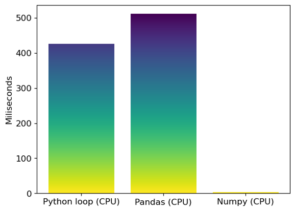
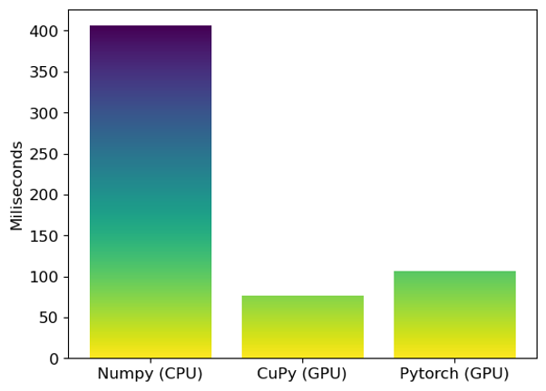

# Example on refactoring CPU code to GPU code

This repository demonstrates the common pattern of how we refactor CPU code to be accelerated with GPU.

## Installation

To install necessary libraries for running the notebooks in this repository, run the following command:

```bash
bash install_lib.sh
```

## Refactor CPU code to GPU code

In [cpu2gpu.ipynb](cpu2gpu.ipynb), we compare the speed of 3 CPU codes and 2 GPU codes to compute wind speed and wind direction given a matrix of u component and a matrix of v component of wind. 
* The first CPU code is a naive loop over all the components of u matrix and v matrix.
* The second CPU code is using pandas apply method
* The third CPU code is a vectorized computation using numpy
* The first GPU code is a vectorized computation using CuPy
* The second GPU code is a vectorized computation using Pytorch

The results are visualized in [cpu2gpu.ipynb](cpu2gpu.ipynb).

The first and second CPU code are exremely slow. Thus, we run them only on a small data (1/16 of the original data). Below is the speed comparison of the first CPU code (loop), the second CPU code (pandas apply), and the third CPU code (numpy) on the small data. The third CPU code is significantly faster due to the use of vectorized computation, although it is still running in CPU.



Because the third CPU code (numpy) is fast enough, we can compare it with the first and second GPU codes on a much larger data (64x of the original data). Below is the speed comparison of the third CPU code (numpy), the first GPU code (CuPy), and the second GPU code (Pytorch) on the large data. As expected, the GPU codes are much faster than CPU codes. Although Pytorch is natively a deep learning library, it can also used for matrix computation like CuPy. However, as shown by the result, Pytorch is slower than CuPy for a simple matrix computation. This is because Pytorch has additional computations such as backward computation that is not exist in CuPy. These additional computations is mandatory to exist in Pytorch because it is needed in deep learning computation.

